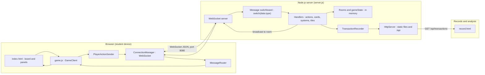
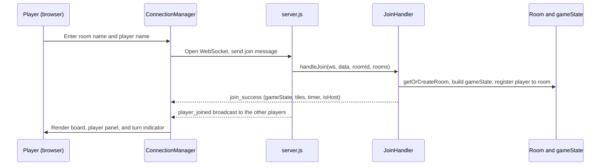
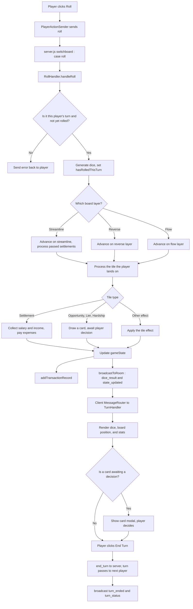
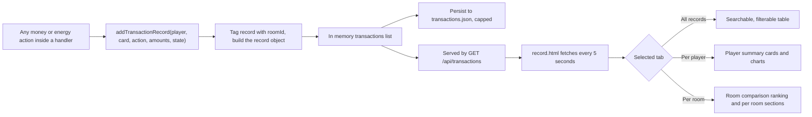

# UnleashBoardGame: Complete Game Logic Flowchart

This document traces the full game logic from the frontend to the backend and back. It complements [`game_logic.md`](game_logic.md) (which describes the game rules) and [`HANDOVER.md`](HANDOVER.md) (which describes the codebase). All diagrams use Mermaid and render automatically on GitHub.

The architecture follows one consistent principle: **the server is the single source of truth.** The client sends intentions (roll, purchase, end turn), the server validates them, updates `gameState`, and broadcasts the authoritative result back to every player in the room. The client only renders what it receives.

---

## 1. System architecture (frontend to backend)

A high level view of the major components and how a message travels between them.

**Key components**

| Side | Component | Responsibility |
|------|-----------|----------------|
| Client | `ConnectionManager` | Opens the WebSocket, sends and receives JSON messages |
| Client | `PlayerActionSender` | Serialises player intentions into outgoing messages |
| Client | `MessageRouter` | Maps each incoming message type to the correct client handler |
| Client | `game.js` (GameClient) | Owns the managers and the local copy of state, drives rendering |
| Server | `server.js` | Accepts connections and dispatches each message by its `type` |
| Server | Handlers | Contain the actual game logic (join, roll, cards, loans, tiles) |
| Server | `TransactionRecorder` | Records every money and energy change for the analysis page |

---

## 2. Connection and join sequence

How a student joins a room and receives their starting state.

The player's chosen room name becomes the `roomId`. If the name already exists the player joins that room; otherwise a new room is created (up to eight players each). The room is also recorded so that later transactions can be grouped by room.

---

## 3. Core turn loop (the main game logic)

This is the heart of the game: what happens from the moment a player rolls the dice to the moment the turn passes on.

**Notes on the turn loop**

- The turn lock `hasRolledThisTurn` prevents a second roll in the same turn, and it must be true before End Turn is accepted.
- Each board layer keeps its own position. Passing over a settlement tile still triggers income and expenses, even when the player does not land on it exactly.
- Every branch that changes money or energy calls `addTransactionRecord` before the result is broadcast, so the analysis page stays in step with play.

---

## 4. Card interaction flow

Opportunity, revelation, lier, hardship, and similar cards follow a draw, decide, resolve pattern.

```mermaid
flowchart TD
    A["Player lands on a card tile"] --> B["Server draws a card and sends card_type_selection or a card_draw message"]
    B --> C["CardHandler displays the card modal"]
    C --> D{"Player decision"}
    D -->|Purchase| E["purchase_card to server"]
    D -->|Execute| F["execute_card to server"]
    D -->|Skip| G["skip to server"]
    E --> H["OpportunityCardHandler or the matching card handler"]
    F --> H
    H --> I["Validate cost and energy, then update gameState"]
    I --> J["addTransactionRecord"]
    I --> K["broadcast card_purchased or card_executed, plus state_updated"]
    K --> L["Client renders the outcome"]
    G --> M["broadcast card_skipped"]
    M --> L
```

The server validates affordability and energy before applying any effect, so an invalid choice is rejected rather than trusted. Some cards require additional input (for example choosing a target player or picking one card from several); these send a follow up prompt and wait for the player's response before resolving.

---

## 5. Records and analysis data flow

How gameplay turns into the teacher facing charts on `record.html`.

Records are tagged with the player's room through `gameState.roomId`, with a player to room fallback map for records that carry no state. Records created before room tagging existed appear under the label 未分配.

---

## 6. End to end message reference

The complete round trip for the most common action, a dice roll, named at each hop.

```mermaid
flowchart LR
    subgraph FE["Frontend"]
        A1["Roll button"] --> A2["PlayerActionSender.send(roll)"]
        A2 --> A3["ConnectionManager.send"]
    end
    A3 -->|"roll"| B1
    subgraph BE["Backend"]
        B1["server.js on message"] --> B2["switch case roll"]
        B2 --> B3["RollHandler.handleRoll"]
        B3 --> B4["Tile processors and card handlers"]
        B4 --> B5["gameState updated, addTransactionRecord"]
        B5 --> B6["broadcastToRoom"]
    end
    B6 -->|"dice_result, state_updated"| C1
    subgraph FE2["Frontend"]
        C1["ConnectionManager.onmessage"] --> C2["MessageRouter"]
        C2 --> C3["TurnHandler.handleDiceResult"]
        C3 --> C4["Render board, stats, and log"]
    end
```

**Message vocabulary**

| Direction | Examples |
|-----------|----------|
| Client to server (actions) | `join`, `roll`, `end_turn`, `purchase_card`, `execute_card`, `apply_loan`, `repay_loan` |
| Server to client (results) | `join_success`, `dice_result`, `state_updated`, `turn_ended`, `card_type_selection`, `card_purchased`, `settlement` |

---

## 7. How to read these diagrams

- A rectangle is a step or a component.
- A diamond is a decision, with each outgoing arrow labelled by the outcome.
- A solid arrow is the normal path of data or control.
- A labelled arrow across the client and server boxes is a WebSocket message; the label is the message type.

For the underlying rules behind each step (income formulas, loan interest, card effects, win conditions), refer to [`game_logic.md`](game_logic.md).
